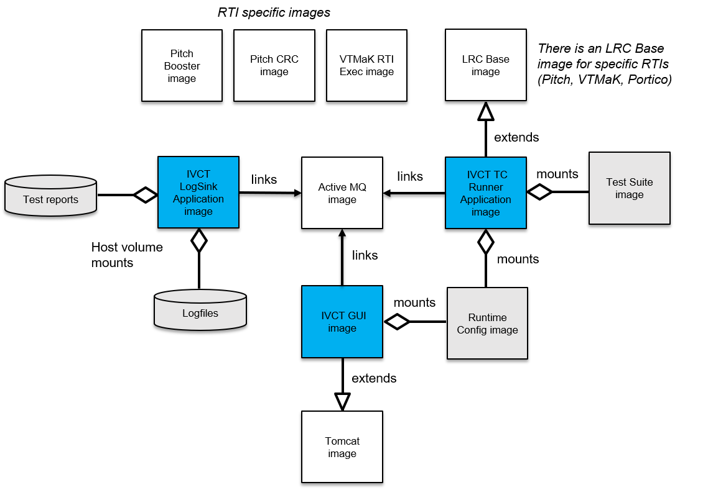

The application of Docker container technology allows a user to run the IVCT without having to build and install the IVCT Framework and its dependencies. All that is required is a functional Docker engine installed on a host. See https://docs.docker.com/install/ for instructions on installing a Docker engine.

The containerized version of the IVCT consists of several Docker container images. An overview of the container images and the relationships between them is provided in the following figure.

The color coding of the images is:

- **BLUE**: IVCT container images ([[IVCT TC Runner Application-image|IVCT TC Runner Application image]], [[IVCT GUI image|IVCT-GUI-image]], and [[IVCT LogSink Application image|IVCT-LogSink-Application-image]]).
- **GREY**: IVCT data volumes (as container image or other storage class).
- **WHITE**: These are outside the scope of this GitHub project. E.g. the HLA RTI related container images.

The relationships are:

- **links**: container image establishes network connection to other container image at run-time.
- **extends**: container image is based on the other container image (see Dockerfile FROM instruction).
- **mounts**: container image mounts the indicated data volume at run-time.
