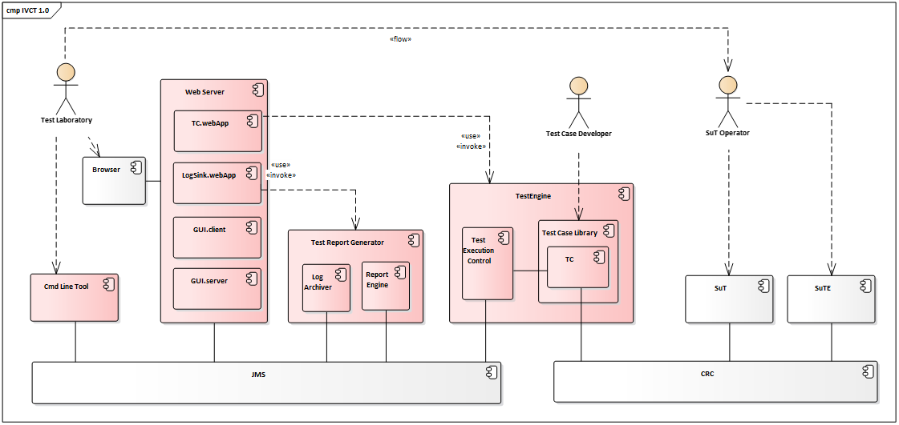

The IVCT consists of the modules shown in the picture below

On the left side there are the IVCT modules communication via an JMS message bus. On the right side is the HLA run time infrastructure with the System under Test (SuT) and optionally the System under Test Environment (SuTE). Both sides are connected by the TestEngine, which is tasked by the IVCT user interface modules, and which is part of a federation with the SuT and the SuTE.

There are two user interface components, which are the command line tool (CmdLineTool) and the graphical user interface (GUI). The CmdLineTool is a text base command line interpreter, and implements a simple user interface to the IVCT. The GUI implements a graphical user interface, which is embeded in a web server container. 

The TestReportGenerator is a stand-alone application listening to messages on the message bus and creating report and protocol files.