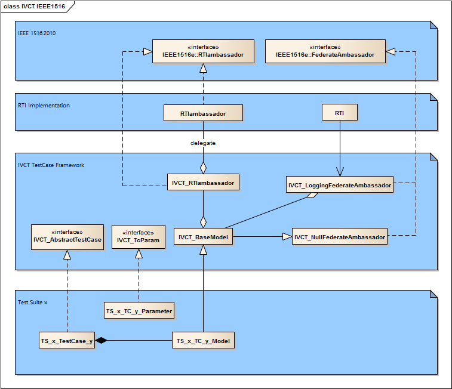

# Overview

A test case (TC) is a program designed to test a certain aspect of a communication protocol. The aspect to be tested is described by a test purpose. The task of a TC writer is to write a program that performs the test specified by a test purpose. To be able to write these programs it is necessary to understand the environment in which the TC program runs. The rest of this guide will describe the test system architecture, how logging is used and how to create TCs.

# Test System Architecture

The test system is designed to support the TC writer by automatically logging all HLA services and parameters, support a TC structure with three distinct phases according to ISO 9646 and allow the TC writer to add routines of any required complexity into a test suite specific library. Thus after a certain design phase and initial implementation of the library, the TC writer can concentrate on the logic specific for a TC and let the rest of the test system handle the repeating and time consuming details within the library.

## IVCT_NullFederateAmbassador

Serves as a base class for a IVCT federate ambassador. The default behaviour for a callback is to log each method as "_method name_ not implemented". Wherever a TC writer wants to handle a callback, he needs overwrite an HLA federate ambassador service by adding a method in the TS_x_TC_y_Model with the same HLA service signature. 

## IVCT_RTIambassador

The automatic RTIambassdor logging is achieved by using the IVCT_RTIambassador whose only purpose is to do the logging of the HLA services and parameters, and forward these services to the real RTIambassdor. Thus a HLA service call will be made to the IVCT_RTIambassador which then performs its tasks and forwards the service.

The IVCT_RTIambassador is available within the TC and also within the TS_x_TC_y_Model. A required HLA service call in the TC can either:
* if no data needs to be stored within the TS_x_TC_y_Model, call the IVCT_RTIambassador directly 
* if any data needs to be stored within the TS_x_TC_y_Model, then a method with the same HLA signature should be added to the TS_x_TC_y_Model. This method shall store the data and call the IVCT_RTIambassador

## IVCT_LoggingFederateAmbassador

The automatic federateAmbassador logging is achieved by using an extra logging federateAmbassador (IVCT_LoggingFederateAmbassador) whose only purpose is to do the logging of the HLA services and parameters, and forward these services to the TS_x_TC_y_Model. Thus the RTI will call the IVCT_LoggingFederateAmbassador and it will in turn forward the call to the TS_x_TC_y_Model.

## IVCT_BaseModel

This is a base class to specify the how the generic TC library interfaces to other modules. The IVCT_BaseModel specifies how the TC library interfaces to the HLA services and contains some generic methods to initiate and terminate the federate membership in the federation.

## TS_x_TC_y_Model

The test suite specific library (TS_x_TC_y_Model) is a crucial component used by the TC to handle HLA services and data. The TS_x_TC_y_Model has a reference to an extra logging RTIambassdor which is called for all HLA services. The TS_x_TC_y_Model itself is a federateAmbassador which receives any callback calls explicitly implemented with the relevant HLA method signatures, any calls that are not implemented are handled by the IVCT_NullFederateAmbassador.

All callback services are logged by an extra logging federateAmbassador before being sent to the TS_x_TC_y_Model. The TS_x_TC_y_Model will be programmed to store any relevant data (may be from requests or callbacks) within the TS_x_TC_y_Model. The storage of data may become very complex depending on the protocol. The data should be stored in such a way that it can be easily retrieved and evaluated at a later point in time.

## IVCT_AbstractTestCase

The IVCT_AbstractTestCase is the base class for conformance TCs specified according to ISO 9646 and have the three phases: preamble, test_body and postamble. The TC will issue a verdict at the end of the TC execution.

There are other kinds of TCs which are suitable for integration support that observe a particular aspect of an HLA application over many cycles and detects any issues. It has to be determined whether another abstract test case is required or this one can be used with certain interpretations of TC phases and verdicts.

## TS_x_TestCase_y

A test case is derived from AbstractTestCase which enforces the ISO 9646 concept of preamble, test_body and postamble. In the preambleAction the protocol sequence and data to bring the SUT into the state required for the test purpose is specified. In the performTest is the sequence and data to test the purpose of the TC. In the postambleAction is the sequence and data to bring the SUT back into a stable state.

## IVCT_TcParam

The IVCT_TcParam is the base class for SUT specific parameters. For most TCs, SUT specific values are required for certain HLA requests or occur in callbacks. These parameters usually are found in a config file or a properties file. Only general parameters are to be placed in this class, parameters for for specific test suites shall be placed in a derived class.

At the point of writing this document, the mechanism for reading from a config file or a properties file has not been determined. Fixed values were used in the demo TCs.

## TS_x_TC_y_Parameter

This class is derived from the IVCT_TcParam class and loads and contains specific SUT values required in a test suite. To protect the data values, it is advisable to write retrieval methods to get the data values. Examples of these values could be object names, subscription / publication classes etc.

## Callbacks

Callbacks are received by adding methods with the same HLA signature to the TS_x_TC_y_Model. The required data is then stored as necessary within the TS_x_TC_y_Model for use in the test case. Data retrieval methods should also be added to the TS_x_TC_y_Model to avoid any accidental corruption of the stored data.

Callbacks are asynchronous calls and thus require some mechanism to check if a particular callback has been received. There are several ways this can be done: i) set a flag within the TS_x_TC_y_Model to false, then call a RTI method and poll the TS_x_TC_y_Model to check if the particular callback has set the flag to true ii) use a semaphore which is waited on in the test case and is released when a specific callback arrives within the TS_x_TC_y_Model. Afterwards the TC has to retrieve the data received from the TS_x_TC_y_Model for evaluation within the TC or delegate this evaluation to a method within the TS_x_TC_y_Model. The method may also be written that waiting and evaluation occuer within this one method.

## Logging

The test system uses the SLF4J to log the TC and protocol data. The test system uses logback to send the log data via a JMS bus to a central log management component. The log data is distributed to various files according to the type of data. The verdicts are collected and written to a test session summary.

The log level (info, error, warning etc.) may have to be adjusted for certain HLA services where the frequency of calls and amount of logging text is exceeds the logging resources or that logging the calls may be optimized or ignored if only some or no information is required.

## Test Results

If all three phases of the TC (preamble, test_body and postamble) occur without error, then a TC is determined to be PASSED. If an error occurs in the test_body and the test purpose was not met, the verdict shall be FAILED else if some other error occurs, the verdict shall be INCONCLUSIVE. If an error occurs in preamble or postamble the verdict shall be INCONCLUSIVE. A text message should be included in the verdict in case of FAILED or INCONCLUSIVE. The test system shall record all the verdicts of a test session and make a summary of the verdicts and corresponding text messages.

# Quick Guide to writing Test Cases

## Test Purposes

The starting point of writing TCs is to have a collection of test purposes. Each test purpose should lead to writing one TC. A TC writer will then determine the protocol sequences (and data) required to get the SUT into the state required for testing, to do the test and to get the SUT back into a stable state. A good knowledge of the protocol to be tested is necessary to specify the sequences of requests and responses required to perform the test. The TC writer should also check the TS_x_TC_y_Model for existing methods that cover the sequences required since that lessens the effort to implement the TC.

## Test Case Nomenclature

To help organize and select TCs, it is very useful to have a naming scheme for TCs. Some ideas for classification are testing valid behaviour, invalid behaviour or stress tests. Another classification could be service group. Thus a possible naming scheme could be (only an example):

`T00000`

`||||||`

`|-------> T for test case (1 digit)`

`-|------> test type       (1 digit)`

`--||----> service group   (2 digits)`

`----||--> running number  (2 digits)`

A good nomenclature helps identify TCs and automatically select TCs, thus it should be considered before writing any TCs. Different test suites can have widely differing naming schemes depending on the nature of the service protocol. The naming scheme is an essential part of the documentation of the test suite.

## TS_x_TC_y_Model (Test Suite Specific Model)

It should be pointed out that using the methods from the TS_x_TC_y_Model are equivalent to explicitly using the services in a TC. A well-designed test suite will place the methods that non-trivial and are used by more than one TC into the TS_x_TC_y_Model. The TS_x_TC_y_Model is derived from the IVCT_BaseModel which contains e.g. the initiateRti and terminateRti methods to use in most HLA protocol test cases.

TCs usually have a number of protocol sequences, test evaluation logic, data generation etc... in common. These can be programmed once and placed in the TS_x_TC_y_Model for use by any TC in the test suite. The bundling of initiateRTI and terminateRTI sequences in the IVCT_BaseModel is a good example of this kind of code. All HLA services and any necessary program logic are available in the TS_x_TC_y_Model. It should be noted however that the TS_x_TC_y_Model is most useful and maintainable when the methods and code are straight-forward and well-documented.

Callbacks are called asynchronously, but have to be evaluated at a given point by the TC. The test case writer has to decide whether to use polling, semaphore etc... to synchronize and evaluate the callbacks with the TC logic. The mechanism of how the synchonisation works should not appear in the TCs, but should be in a method in the TS_x_TC_y_Model where it can be maintained or changed independently of the TCs themselves.

## Test Case Parameters

As of this time of writing it is not clear how a TC will get parameters such as federation name, customer name etc. from the test control system. This information can be used to parameterize the TC or specify where customer config files are located. Some parameters may contain SUT specific data values which are necessary for the TC to run correctly. The number test case parameters may increase during the development of the test suite as the TC writer sees more possibilites to use the value. The config file with the test case parameters should be completed by the customer and it is considered part of the conformance statement.

There are two types of parameters: 1) those that are SUT specific (e.g. name of SUT federate) and 2) those that are test system specific (e.g. name of TC federate). The test system specific data should be handled in a consistent manner throughout all the test suites.

## Test Case Variables

There are several ways to handle variables within the test cases: explicitly in each TC, in an extra class to hold all TC variables or within the TS_x_TC_y_Model as public variables. The test case writer has to decide which way is the best to use. Each test suite can handle these TC variables differently if desired, but there is an obvious advantage if one style is used in all TCs: it is easier for all TC readers / verifiers to understand any TC.

## Test Case Coding

Using a TC template as basis for the TC, the TC writer should add the text of the test purpose at the beginning of the TC execution so that this appears in the log file for the TC. 

The TC writer should decide what send services (with data), receiving callbacks and received services (with data) evaluation are needed to implement the test purpose. The TC writer will program the TC using a combination of explicit TC sequences and methods from the TS_x_TC_y_Model to perform these sequences. These services have to be distributed to the phases: preamble, test_body and postamble. At various points in the TC execution it will be necessary to wait for callbacks from the SUT and evaluate these before continuing with the TC execution.

### Test Case Methods

When writing a test suite, the same logic for handling a sequence of services or evaluation may be required for more than one TC. In such a case a method to handle this logic should be added to the TS_x_TC_y_Model. These methods should be written in a straight-forward manner so that they can be verified easily since they constitute put of a TC.

### Test Case Loops

It may be interesting to have a loop in the TC to do the same sequences in the test_body with different data values. The TC should be stopped upon detecting an error and the verdict message should include the index value of the loop when the error occurred.

## Testing Test Cases

Even TCs have to be tested and the best way to test them is to have a reference implementation from the group that wrote the protocol to be tested. If not available, a customer implementation may be used with the thought that errors may exist in both the TCs as well as the implementation. All TCs should be run at least once and the TC log files should be examined by a protocol expert to determine whether the TCs are executing correctly. In cases of FAILED and INCONCLUSIVE the protocol expert must carefully the protocol activity and data, and determine what the problem is and how to fix it. Once the test suite is considered to be running in a stable manner, it may be presented to the Accreditation Authority for approval.
