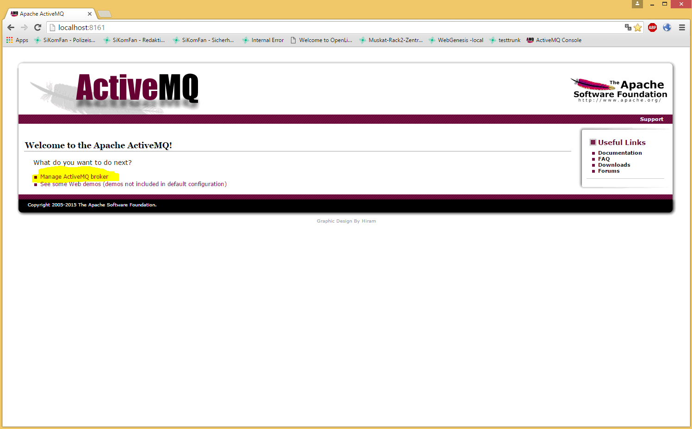
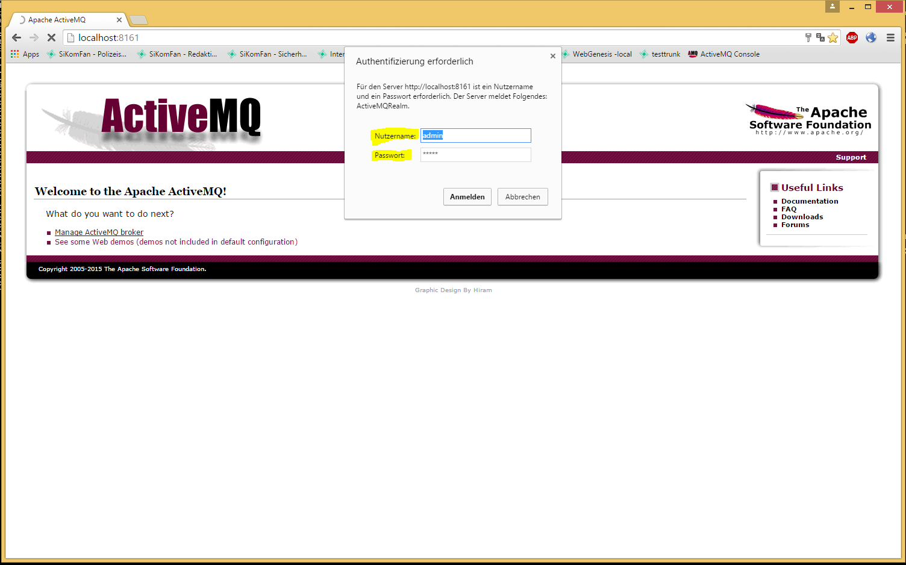
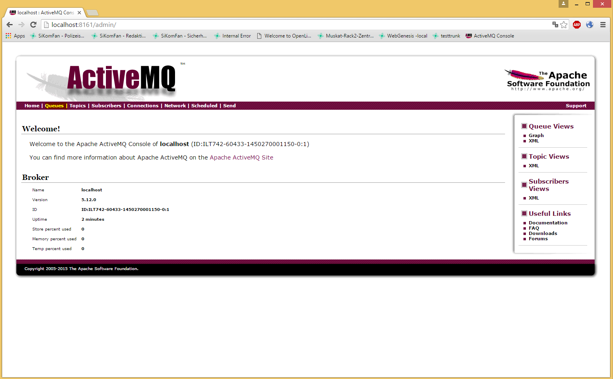
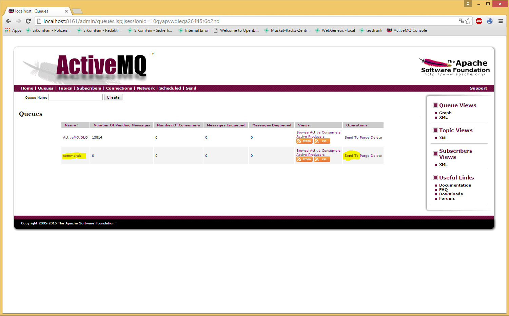
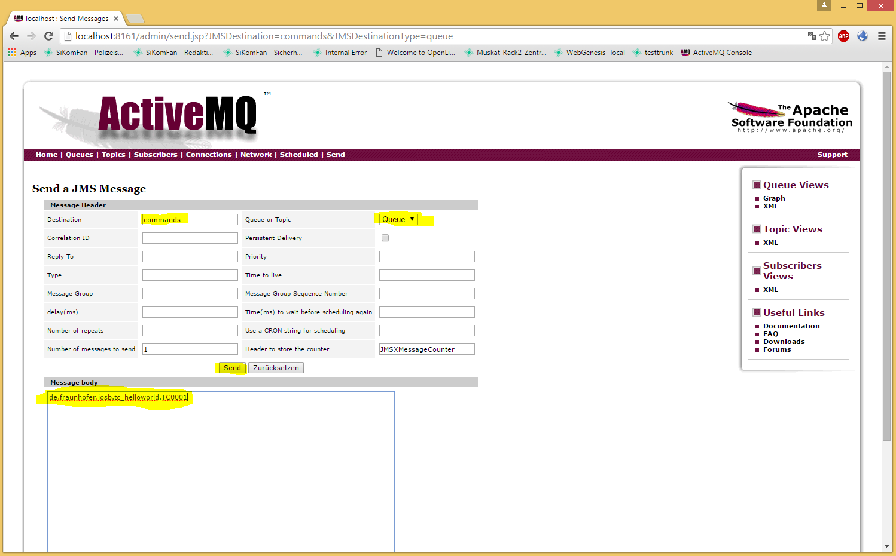

#The JMSTestRunner

The JMSTestRunner allows to start a test case via sending the classname of the test case via the JMS-Queue named "commands".

Since there is no plugin mechanism for the JMSTestRunner at the moment, you will have to add the jar containing the Test case to the classpath of the TestRunner.

If you are using eclipse you can simply add the eclipse-project containing the test case to the launch configuration of the JMSTestRunner.

After setting up the classpath and starting the JMSTestRunner, you open the webfrontend of activemq and navigate to Queues. There you should find a "commands" queue. By clicking on "Send to" a window will open where you can type in the classname of the TestCase (e.g. de.fraunhofer.iosb.tc_helloworld.TC0001).
By receiving this message, the JMSTestRunner will instantiate the test case and execute it.

### Open ActiveMQ console and select "Manage ActiveMQ Broker"

Access the running activeMQ service with a web browser, by opening the page http://localhost:8161 (Login/Passw: admin/admin). You need to login to see the menu with links to topics, subscribers, etc.

### Login (admin/admin)

### Navigate to Queues

### Locate Queue "commands" and use "Send to" Operation

### use Classname of testcase as message Content to trigger execution
**Don't forget to include the neccessary libs to the Classpath of the JMSTestRunner!**
