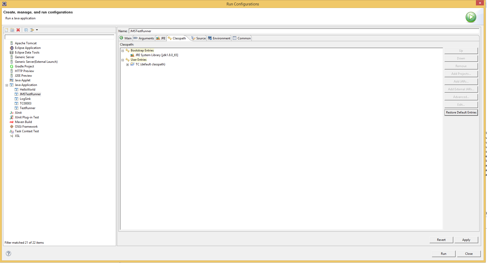
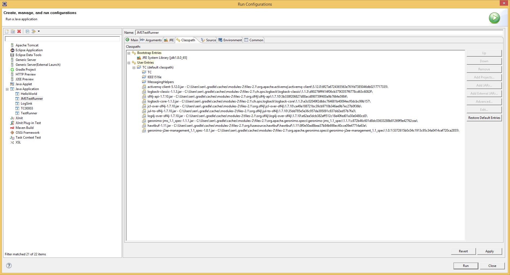
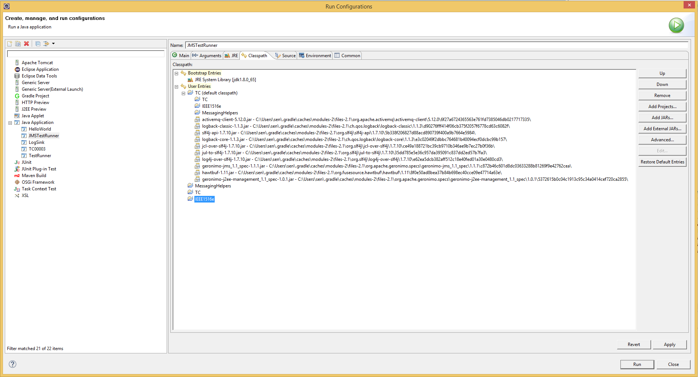
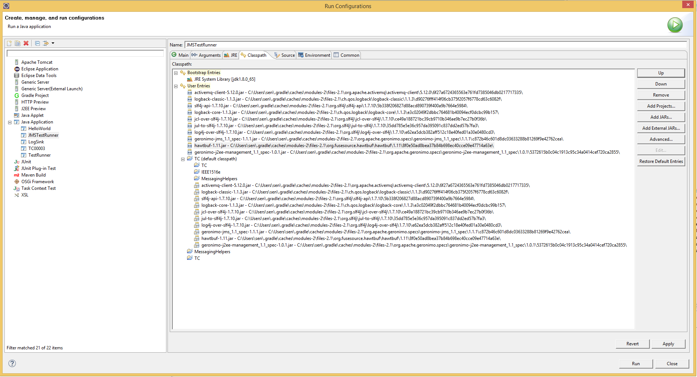
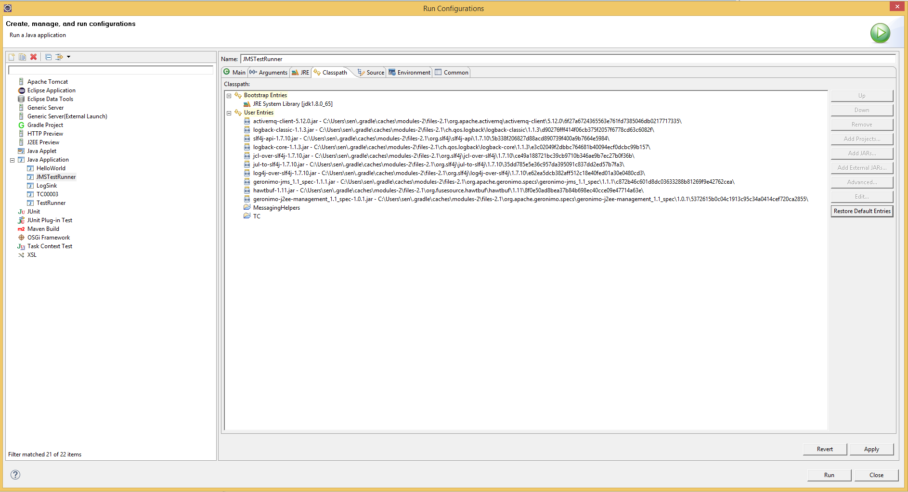
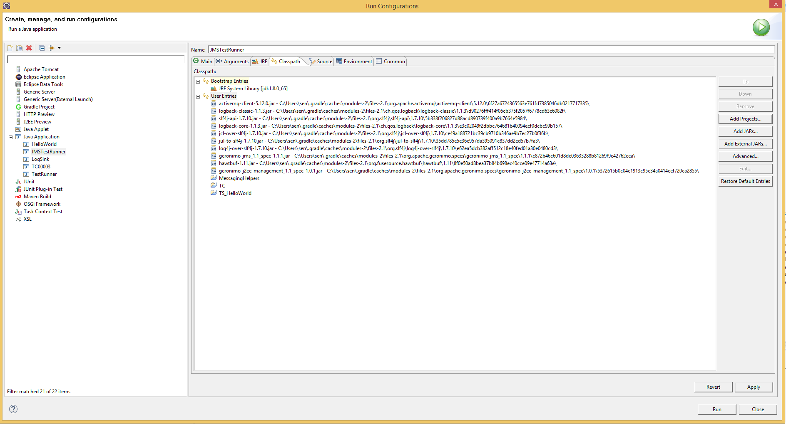
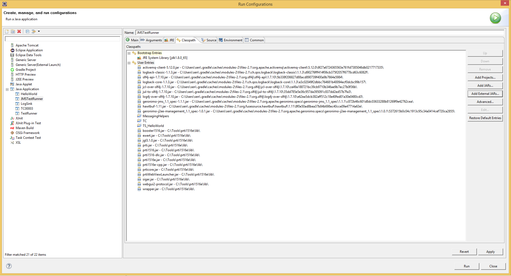

# Screenshots for launch configurations
## A List of screenshots how to remove the IEEE1516 project from the launch configuration
Caution: Since the referenced jars are located in your local gradle cache, the folder names will most likely differ from the ones shown in these screenshots!

### PRE-Step 0: Create launch configurations for the classes you want to run via eclipse, e.g. the JMSTestRunner
 * select  Run --> Run Configurations ... from the eclipse menubar
 * right-click on "Java Application" in the tree of the Run Configuration Window and select "new"
 * in the main Tab of the "Run Configurations" window:
   * change the name of the new configuration ("JMSTestRunner")
   * set the Project to "TC"
   * set the Main class to "de.fraunhofer.iosb.testrunner.JMSTestRunner"

### Step 1: Open Launch configuration and navigate to Tab "Classpath"

### Step 2: Expand Launch configuration

### Step 3: Add Projects

### Step 4: Remove IEEE1516e project

### Step 5: Add external jars

### Step 6: check if all projects and jars have been added manually and then remove default classpath

## Add the project containing the Testcase to the launch configuration

## Add 3rdparty RTI (here Pitch pRTI Free v. 5.0.1.1) libs to launch configuration
