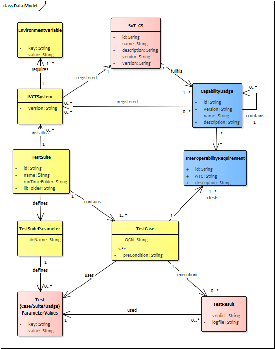

The IVCT framework is defining a set of elementes to describe system under test capabilities, as well as badge definition, test case implementations and test results. These elements are refert to as the IVCT Information Model.

The image below gives an overview

The information is split into several JSON files for easier maintenance. The badge definitions are imported from the badge information management systems. 
The HelloWorld badge is an example for a badge file:

    {
        "id" : "HelloWorld-1.0.1",
        "version": "1.0.1",
        "name": "HelloWorld Tutorial Badge",
       "description": "This is a simple example for capability badge to test the compliance of an federate to the hello world federation.",
        "dependency": [],
        "requirements": [
            {
                "id": "IR-HW-0001",
                "description": "Test population growing rate",
                "ATC": "Observe the federate for a fixed number of cycles and compare the latest received value with the previously received value plus the fixed percentage and a small tolerence for each cycle."
            },
            {
                "id": "IP-HW-0002",
                "description": "Test inter-country communication",
                 "ATC": "..."
            }
        ] 
    }

The conformance statement will be provided by the system under test, and is used to determine the applicable test cases. The conformance statement for the helloWorld federated looks like:

    {
        "id": "hw_iosb"
        "name": "Hello World Demo Federate"
        "description": "HelloWorld system under federate for IVCT demonstration",
        "badge": ["HelloWorld-1.0.1","HLA-BASE-2017","TS_HLA_EncodingRulesTester-2017"],
        "vendor": "Fraunhofer IOSB",
        "version": "1.0.1"
    }
