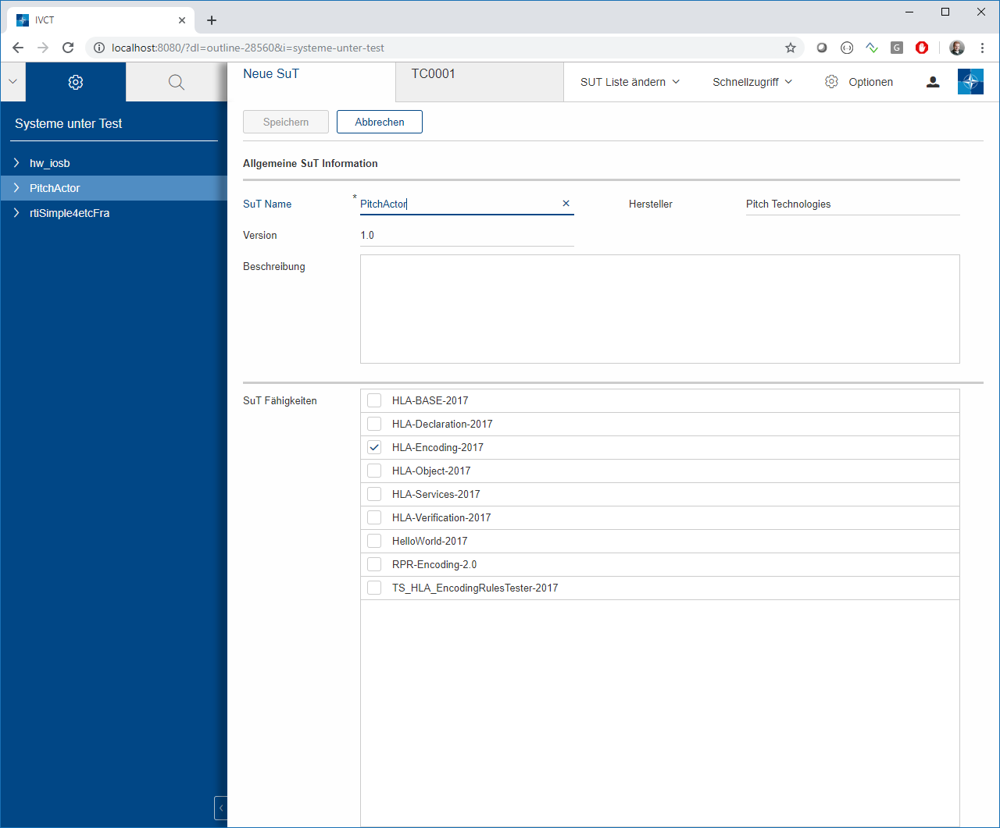

= The Grapical User Interface

== Introduction

The Graphical User Interface (GUI) is browser application, based on a web server running in your IVCT installation. You need to open your preferred html browser and open up the URL to the web server. In a local installation, this would be typically

  http:/localhost:8080

However, in your case this might be a different location. Please contact your system administrator for installation details.

In the standard installation, the first page will be the login screen. Only authorized users are allowed to use the IVCT installation. Again, please contact your system administrator for your user credentials (the initial installation will use admin/admin)

After successful login the IVCT GUI will be started. The general layout concept consists of a menu bar on the top part of the page, a navigation frame on the left side with a blue background, and content frame on the right side with a white background.

The Navigation frame has two parts, selectable via the little ‘^’ in the top left corner. The first one is the so called “Badges” view, and the second one is the “System under Test” view. These views are described below in more detail.

== The Badge View

In the badge view, all installed compliance badges are shown. While no badge is selected in the navigation frame, the content frame shows the same overview list in an iconic layout.

When a badge is selected in the navigation frame, the details will be shown in the content frame. These general information like the name, a short description and a visual key representing the badge.
A badge also contains interoperability requirements, either directly assigned to the badge, or indirectly by a dependency definition to another badge. These interoperability requirements are assigned to test cases, which need to be passed in order to be considered compliant to that badge.

== The SuT View

The System under Test (SuT) view, shows the configure systems to be tested. New systems for testing can be added with the menu <new SuT> and existing configurations can be edited, after selecting them. The selection of a SuT shows the details view for that system under test.

The details view shows general information about the system under test, like its name, vender and version, as well as short description for its purpose.
If the selected SuT has already been tested, the test reports will be listed below the general information. A report can be inspected by a double-click. This will open a new tab in the content frame with a text view. You can close this tab with the close button in the menu, or you leave it open for later use.

For the RTI configuration see [[Local Settings Designator]]

When selecting a SuT in the navigation frame, the underlying badges are shown. These are the badges which are named in the conformance statement when creating a SuT description. Selecting a badge will show the details to be used for testing the contained interoperability requirements. These are test case parameters, optionally some extra parameters as required by some test cases, and finally the list of interoperability requirements.

In order to test an interoperability requirement, it must be selected in the navigation frame. That opens a detail view in the content frame, with a short description and a list of reports with existing protocol files. With the button <TC execute> in the menu frame, the test case assigned to this interoperability requirement can be started. This will open a new tab in the content frame.

The test case execution tab shows the current status of the running test case. The messages in the status table are created by the test case and will give insights on the current test activity. A detailed protocol log shows the current output of the running test case.

The creation and editing of SuT descriptions will be opened in an edit tab. In that tab you may change the name, vendor and version, as well as the description text for the SuT.

An important part of the description is the definition of the SuT capabilities. The selection of the available badges, is considered as the conformance statement of the SuT. This selection will define the interoperability requirements to be used for the compliance testing.

