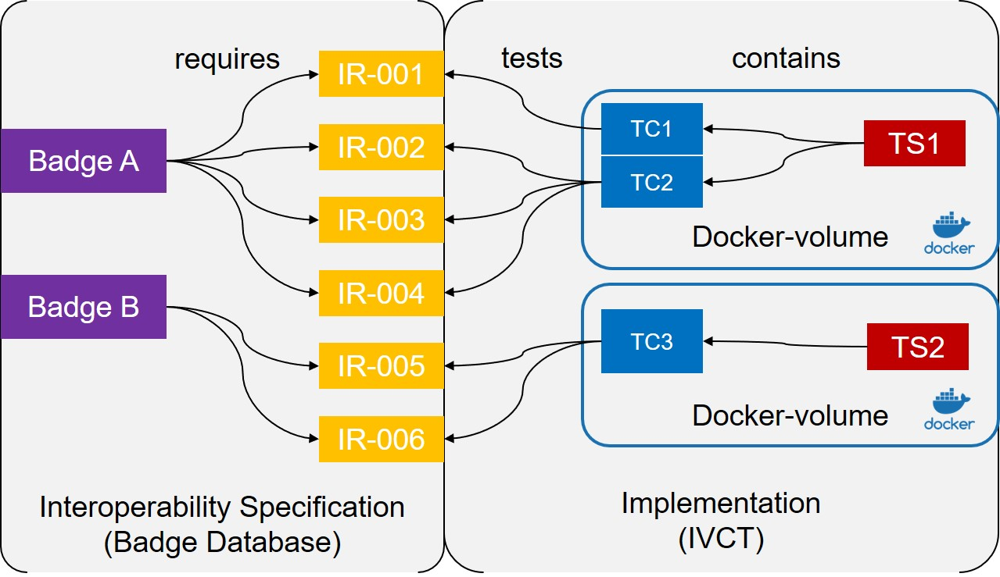

== Linking Interoperability Badges with Test Suites

=== The Concept

In important concept for the IVCTool is the selection of test cases, to verify a interoperability specification. Such a interoperability specification is based on the concept of the so called **badges**, which are basically collections of individual **interoperability requirements** (IR).

The figure below shows these concepts on the left side. In order to verify these interoperability requirements, the IVCTool contains several collections of **test cases** (TC). Such a collection is called a **test suite** (TS). Implementation-wise, the test suites are docker images, containing several java libraries and possible several implementations of the interface called **IVCT_AbstractTestCase**.

These implementations are test cases, which are verifying the interoperability requirements. To the link between badges and the test suites is defined by the references from the test cases to the tested requirements.

.Linking test cases to interoperability requirements

=== The JSON-based Configuration Files

The information about badges and test suites is defined by a set of JSON-files. The figure below shows some examples for these configurations. A starting point is the **conformance statement** (CS) of a **system under test** (SuT), which contains a list of badges to which the SuT claims to be compliant. The badges themselfs are also defined by JSON-files, and they are containing a list of requirements to be tested, in order to be **compliant** to the badge. The IVCTool is configured with JSON configuration file for each test suite, containing a list of testcases, where each test cases refers to the interoperability requirements it is testing.

.JSON-Configuration files
image:images/Badge2TestCase.jpg[JSON Configuration]

The selection of the test cases to verify the conformance statement is done automatically by the IVCTool. For that reason it is important, that there is no ambiguity for finding the right test case for each requirement. It is therfor not allowed to have multiple test cases for one requirement.

NOTE: In future releases of the IVCTool, this might be changed. It is forseen, that test cases can be selected for testing without a requirement assignment.

In the future, the badge definition files will be generated by the NATO Badge Definition Database, hosted by the NATO CoE in Rom. Until that service is established, the files are added manually to the run-time configuration of the IVCTool.

An example for a test suite configuration file is shown below. The test suite has a unique id and human readable name, an optional version and description field, links to the lib and bin runtime folders, and finally a list of test cases. Each test case is identified with a fully qualified classname, a list of interoperability requirements it is testing, and a description explaining the test purpose.

.Test suite configuration example
[source,yaml]
----
{
    "id": "Testsuite-HLA-Verification-2.0.0",
    "name": "HLA Verification Test 2.0.0",
    "version": "2.0.0",
    "description": "This test case is equivalent to the FCTT_NG configuration verification step.",
    "tsRunTimeFolder": "TS_CS_Verification-2.0.0/bin",
    "tsLibTimeFolder": "TS_CS_Verification-2.0.0/lib",
    "testcase": [{
        "TC": "nato.ivct.etc.fr.tc_cs_verification.TC_001_Files_Check"
        "IR": ["IR-DOC-0001", "IR-SOM-0001", "IR-SOM-0002"],
        "description": "Test SuT CS/SOM to be valid and consistent",
    }]
}
----

=== IVCTool Workflow and Runtime File System

The IVCTool matches the interoperability requirements derived from the conformance statement, with the test suites containing the required test cases to verify the requirements. Most test cases need to be configured for the SuT and the respective SOM/FOM. These configurations are defined by the test suite and will be shared for all test cases within the same test suite.

.UI concept for the test case selection view in the IVCTool

On the runtime file system all configuration data for a system under test (SuT) is folder located in the *$(IVCT_SUT_HOME_ID)* folder. An example for such a configuration will look something like the following file tree:

* $(IVCT_SUT_HOME_ID)/SuT_1
** *CS.json*: The conformance statement of SuT1
** *Reports*: Folder containing all reports files with a verdict summary and references to log files for all executed test cases
** *HLA-BASE-2019*
*** *Testsuite-HLA-Verification-2.0.0*: Folder with all configuration data for this specific test suite
**** *TcParam.json*: The configuration parameters for test cases within this test suite
**** optional configuration files: For some test suites other files are required the test case configuration
**** */Logs*
***** *nato.ivct.etc.fr.tc_cs_verification.TC_001_Files_Check-2019-08-02T073650+0000.log*: Test case execution log file
***** ...
*** *TS-HLA-Declaration-2.0.0*
**** *TcParam.json*
**** ...
** *RPR-FOM-2.0*
*** *Testsuite-HLA-EncodingTester-2.0.0*
**** *TcParam.json* ...
*** ...
** *RPR-FOM-2.0*
*** *Testsuite-HLA-EncodingTester-2.0.0*
**** *TcParam.json* ...

=== Special Cases
==== Test Cases covering several IR's
It is sometimes it may be usefull to implement a test case in a way, to verify several requirements at the same time. In such cases a test case execution will provide test case verdicts for multiple requirements.

==== Multiple References of IR's in one single Conformance Statement
It may happen, that within one SuT conformance statement, there are references to multiple badges, which are sharing the same interoperability requirements. This lead to a special case, where the execution of one test case gives a verdict result, relevant for multiple badges.

==== IR with no test case
